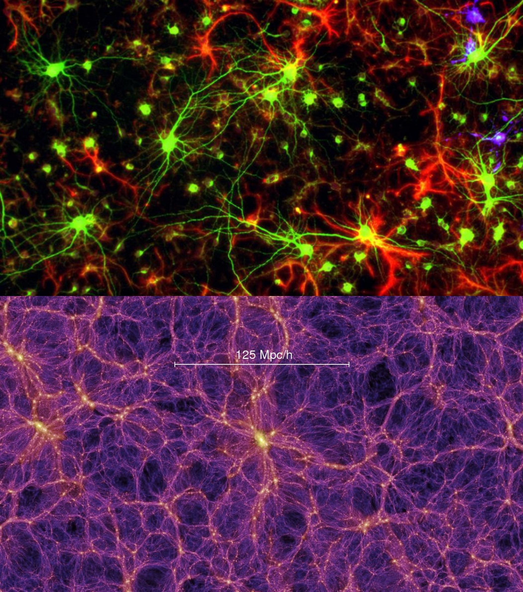

# OOP language agnostic notes (single chapter)

## Terms

### Object

- Vars that belong together are collected / grouped together into an object so they can be treated as a whole unit and passed to other parts of your code.
- An object represents / is a model of some entity that has properties / characteristics. Basically everything you want to represent is an object because nearly everything is a collection of characteristics unless it is a single primitive thing, such as primitive data types: booleans (true / false), numbers, and strings--but even strings can have characteristics, like their length property and string methods.

### Key value pair (KVP)

- Key is aka _property_, _attribute_
- To get access to the value (data) you want, you need to use the key that corresponds to that value.
- A key is like a var name, it is a label / identifier used to access the related data, but an object has multiple key value pairs usually.

```txt
{
  // key: value
  name: "Homer",
  age: 39
}
```

### Method

- A method is just a function that is inside of an object. It usually accesses or mutates / updates data in the object it belongs to.

### Member

- A member is anything that has membership / belongs to an object. So that is keys / properties and methods. Some languages have a few more kinds of properties that are included.

## Index Comparison

- You could store everything in an array / list, it's just harder to remember what index corresponds to what data. Which index is for the first name data? Which index is for the age data? An object is kind of like a list (they are both collections) but you can name each index instead of having to use a number.

## Paradigm

- "a typical example or pattern of something; a model."
- Object Oriented Programming (OOP) is a programming paradigm centered around objects communicating with each other via methods (functions in objects) and grouping data with methods that need access to the data (get) and to mutate / update the data (set) via the `this` keyword.
- As an example, Functional Programming (FP) is another programming paradigm centered on functions, but the data and the functions are kept separate rather than methods being grouped side-by-side with data. This means in FP, any data a function needs must be passed in rather, unlike OOP, where methods can access data that is already available by being grouped in the same object. FP still uses objects, but it favors the above distinctions.

## What is `this` and why do we use it?

- `self` in Python
- `this` is a special keyword whose value can change depending on the context. Just like in natural language, what the word _this_ refers to depends on the context of the conversation (where it is, when it is, what is being talked about) and you easily pick up on the context and know what _this_ means in a conversation. That's because you speak the language fluently, before then, it is confusing and will continue to be confusing in code until you are more fluent.
- In code, the context is similar: where and how the code is being executed determines what the value of `this` is / what `this` refers or points to.
- Is a method being executed from an object (how it's executed) which means the method is located inside (where it is) an object?
  - `this` usually will refer to that object depending on how nested the method is and if it's an function or arrow function.
- Is `this` being used inside a `constructor` function? Then `this` will refer to the new object that is being constructed so that you can add properties to that new instance.
- **Q: Why is `this` used / needed?**
- Since this can change and automatically refer to the object being used `theObjectBeingUsed.fullName()`, that means the full name method can be flexible and give you the full name of whichever object you are executing the method on.
- Without `this`, you would have to replace `this` with some var name, but then it won't be flexible, it will only work for that one var.
- Alternatively, you could replace `this` with a param instead of a hard-coded var name, so it's still flexible, but then that would be excessive and redundant to pass in the object each time even though you've already referenced it to call the method: `theObjectBeingUsed.fullName(theObjectBeingUsed)`

## Pillars of OOP

### Abstraction

- "existing in thought or as an idea but not having a physical or concrete existence."
- To abstract something means to hide the implementation details (in an object or function) so that they need not be understood in order to make use of the abstraction. Think of driving a car, you know how to drive it, but you don't need to know how it works because all of those details have been abstracted away behind the user interface. If you had to understand every part of a car in order to drive it, it would take extremely long to get to the point of making use of it.

### Encapsulation

- "the action of enclosing something in or as if in a capsule"
- Making parts of code private to hide it is a form of encapsulation.
- In a more general sense, a class or object can be seen as a capsule to contain everything related to that object and separate it from the rest of the code.

### Inheritance

- "a thing that is inherited". Inherited: "(of a quality, characteristic, or predisposition) derived genetically from one's parents or ancestors.".
- In this case, the parent and child are classes, and the genes are the properties and methods.
- Inheritance is used to share properties and functionalities. For example, a base Vehicle class can be used so that many different types of vehicles inherit the common characteristics that all vehicles share.

### Polymorphism

- Poly = many, morph = form - occurring in many forms.
- Often occurs because of inherited methods but not only because of inheritance.
- **Overloading**: In many languages can create multiple methods with the same name that can be differentiated by their 'signature' which is the combination of the method's name and data types and order of its parameters. So a method can come in many forms each with their own implementation.
- **Overriding**: An inherited method from the parent class can be replaced (overriden) in the child class with a method of the same name that has a different implementation.

## Main Focus of OOP

- "I'm sorry that I long ago coined the term 'objects' for this topic because it gets many people to focus on the lesser idea." - Alan Kay (creator of OOP)
- "The big idea is 'messaging'." - Alan Kay
  - This is the main thing that glues together smaller systems / programs into the whole system.
- Objects can communicate / message other objects by calling each other's methods and passing data (information / 'messages') to the methods.

### Biology Analogy

- Alan Kay had a biology background before getting into computers so this heavily influenced the way he thought about OOP.
- Objects are like cells which are a small system, many cells form tissues (connective tissue) or organs (larger systems), and organs are grouped together to make up the whole body-system.
- Cells send messages (molecules) to another cell's receptor which can bind to that kind of molecule and the message causes some kind of response action.
- It is this messaging protocol that makes it easier to build a much larger system than otherwise possible. A large-scale example is many computers communicating with each other allows us to create the internet.

#### Network visualizations

##### Neuron connections vs cosmic web (large scale structure of universe)



##### World Wide Web connection of computers graph


#### Biology compared to OOP example


## Related / associated objects

### Associated objects example

1. A `House` **is-a** `Building` (inheritance)
   - A house is a specific type of building which shares the attributes and methods of a building, but a house has additional, house-specific attributes.
2. A `House` **has-a** `Roof` (composition)
   - A house is composed of other objects.
3. A `House` **can be damaged / attacked**. `House` implements an interface to enforce that it can be damaged.

### Abstract formulation

1. An `X` **is-a** `Y` (inheritance).
2. An `X` **has-a** `Y` (composition).
3. An `X` **can be \_\_\_** (implements an interface).

### Composition concept

Putting instances of objects inside of other objects is called _composition_. Whenever you encounter a new technical term, you usually already know what the word means, get in the habit of thinking of the word's meaning outside of tech because this will help you remember what the technical concept is referring to.

Definition:

- (of elements) **constitute or make up (a whole)**.
- "the system is composed of a group of machines"
- In other words: a larger object is _composed_ of smaller objects. Notice how this compares to an object becoming larger from inheriting shared properties and methods from other objects.
- "Composition is a type of relationship between classes where one class contains another instead of inheriting from another. Composition should be favored above inheritance because it's more flexible and allows us to design loosely coupled applications."
- Inheritance is still useful, this is just a warning to not over-use it when composition solves what you are trying to do.
